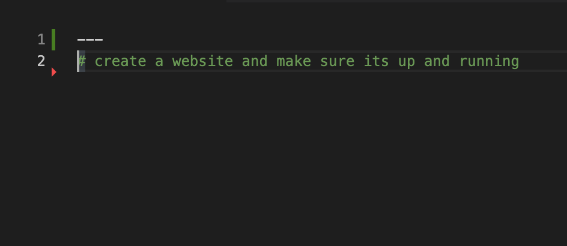
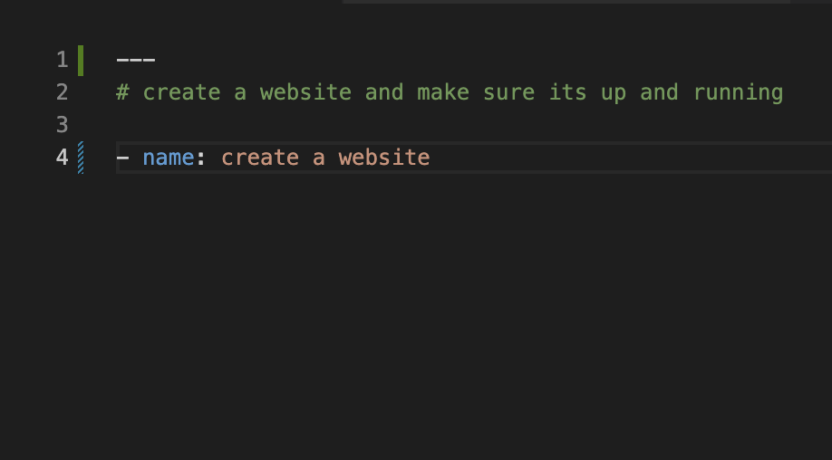
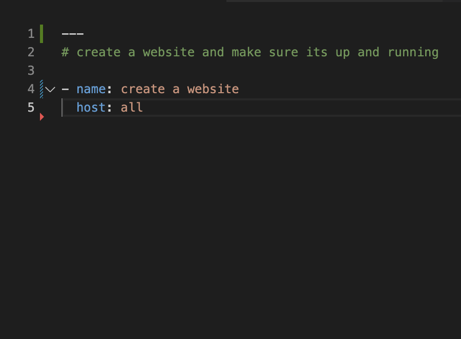
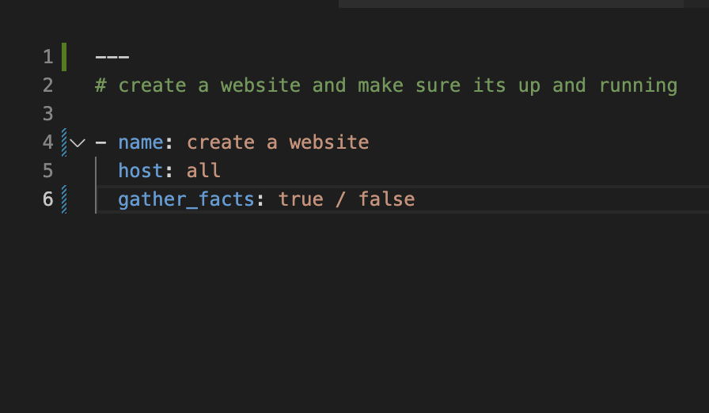
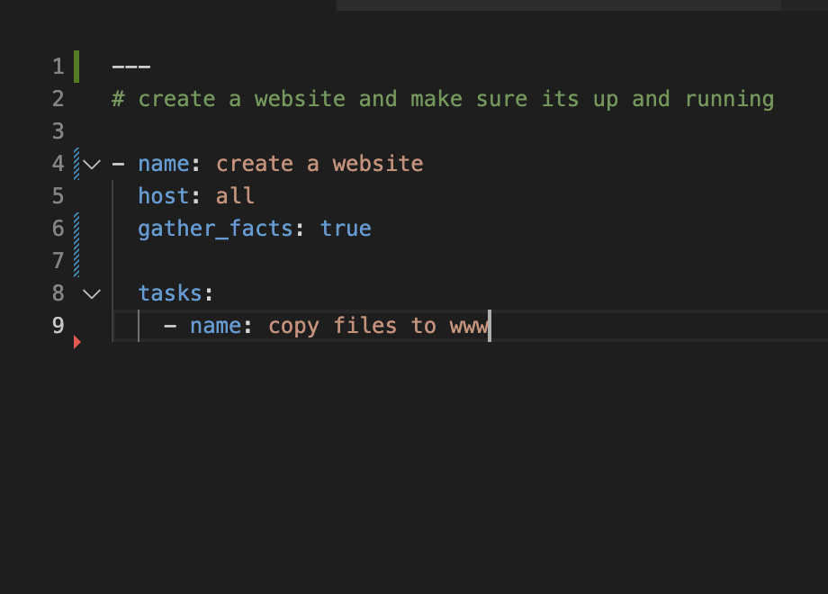
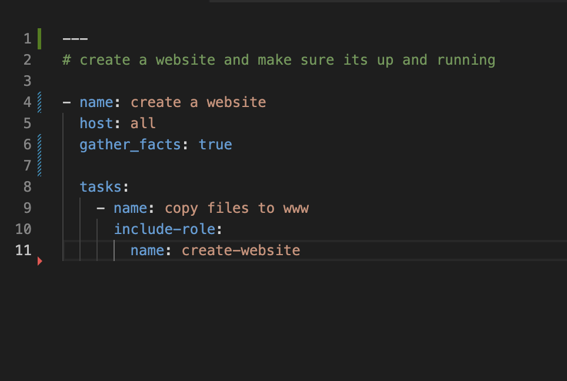
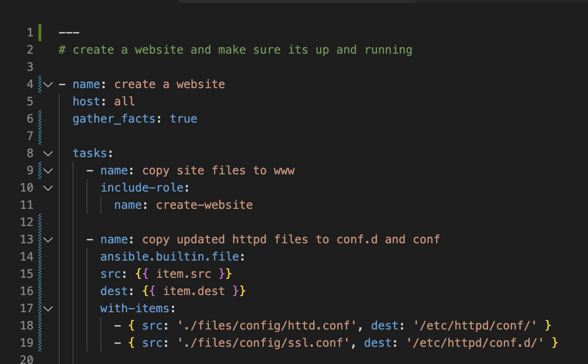
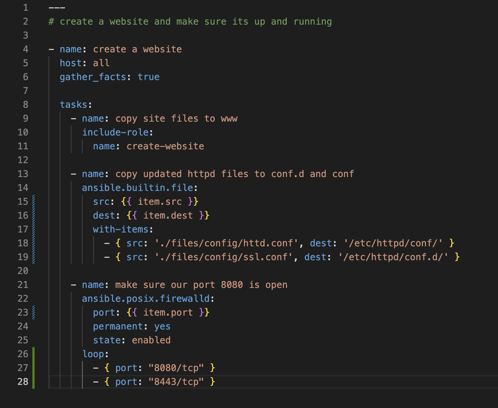
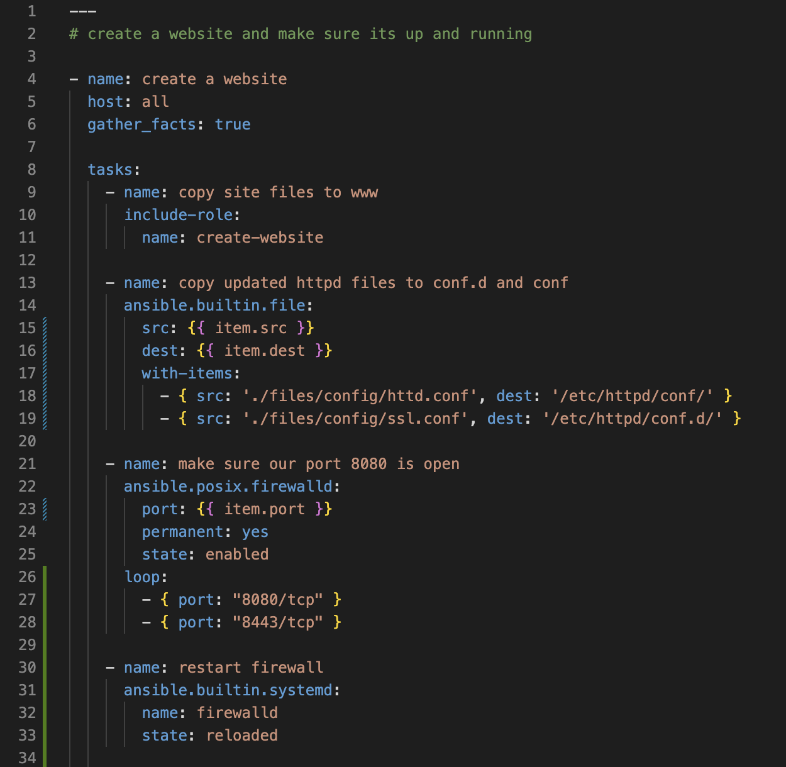
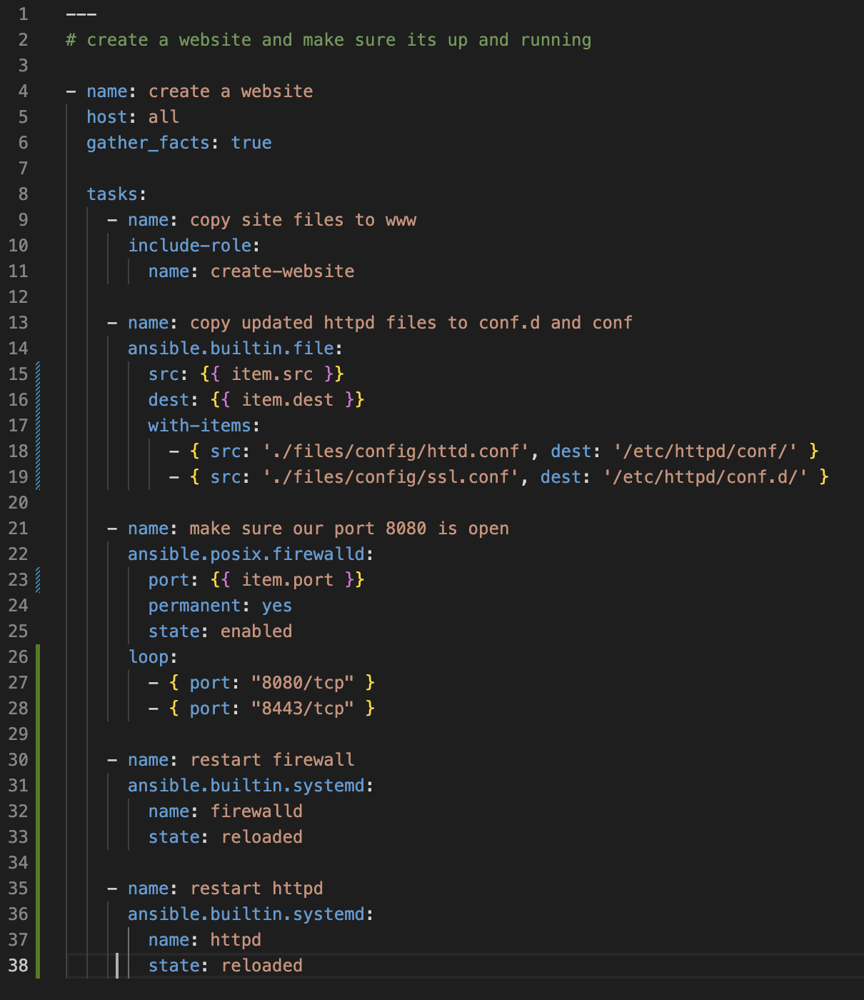

<script> link="rel/stylesheet" href="./readme.css"</script>

# create-website
demo website creation

#### What are we doing here?
<p> So we have need of a getting an app, service, whatever online and running for our group.  This playbook will let us leverage an already created role as well as additional tasks around making sure our firewall ports are open and our service was restarted. <p>

To get started make sure that this repo has been downloaded.  Once downloaded verify the contents of the 'files' directory and look for the following.
- index.html
- package.json
- mithril.js
- css and img folders
  
If all is available use your favorite text editor and open up the create-website.yml file.

Here we have a clean sheet of paper to work with.  Things to note:  a play always startes with ```---```.  you could separate plays in the same file simply by adding ```---``` between groups of tasks you want to separate.  




First we need to start our playbook.  It always starts with a ```- name:```



Next we need to add a host to play against.  There are options here but typically you can call against all hosts and limit that in the inventory file.



The ```gather_facts: yes/no``` option gives Ansible the ability to collect host variables already defined if the user needs to access them in their playbook.  Options here are yes, true, no, or false.  (it changed at some point)



Finally!  Getting to the fun part.  Playbooks are built around tasks.  So lets define our tasks layer and start building a playbook.  Here we are going to be copying our files from the git location to our server.  Every tasks deserves a name (just like the playbook).  Here we are defining the basic operaition - like ```copy files to www```.  This shows up in the logs as a task name so make it specific to what it will be doing.



For this tasks we are going to include a pre-built role.  One way to use roles in a play is the ```include-role``` module native to Ansible.  



Next we will be copying httpd files to configure our ports to 8080(http) and 8443 (https).  For this we will be using another built in module, ```ansible.builtin.file```.  Notice we are also using a plugin native to Ansible called ```with-items```.  This allows us to manipulate more than one file at a time without setting up multiple tasks.   



So we changed our default ports for our web server.  well we need to probably open these ports up in the firewall.  So lets use another module - ```ansible.posix.firewalld```.  This will allow us to open our ports up and make sure we can see our new site!  Here we are using another plugin for Ansible - ```loop```.  Much like with items this will iterate all options underneath the ```loop```116415
 statement.



Once we have our ports our firewall will need to be reloaded.  If you want to prove that out try and go to the website by accessing the IP of the remote server and adding the port to the end of it - ```x.x.x.x:8080```.  

For this task we are using the ```ansible.builtin.systemd``` module.



And finally - we need to reload the httpd service since we changed out the config files.  We will use the same ```systemd``` module for this.  


